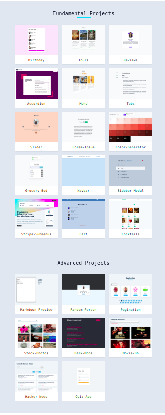

# STEP_2;
My second step on learning React. Bulding A 23 React apps + 1 in React to practice. It is about project consists of 23 different projects.

## The Goal: 
---
Improving and learning new react hooks like:
- useState
- useEffect
- useRef
- useContext
- useReducer 
- useCallback

Practicing on different react aspects too like:
- Forms in react
- Routing in react

## How to use\read the repo:
---
My code is written inside the **setup** folder of each app, ther are also the **final** folder besides, which has the main code that i was compare with, its written by **John smilga the great instructore**  You can see both directors and compare them or you can see my soluiton and how i think to solve a problem

**Note** be fare when you compare, they are my first 
codes that i wrote in React, So they may be not as good as i write React know :`))`;

## Sources
---
- [Youtube Tutorial Video](https://youtu.be/iZhV0bILFb0) of first 15 apps. They are available on YouTube
- [Udemy Course Videos](https://www.udemy.com/course/react-tutorial-and-projects-course/) for the 16:23 apps, last 7 apps. They exclusive only for course subscribers (The videos BUT assets and sources are availble on the main repo with both final and setup files)
- View: [Projects Main Site](https://react-projects.netlify.app/)
- View: [Project Main Repo](https://github.com/john-smilga/react-projects)

## About Apps
---
#### useState:
1. Birthday Reminder

#### useEffect and Conditional Rendering: 
2. Tours
3. Reviews
4. Questions
5. Menu
6. Tabs
7. Slider

#### Forms
8. Lorem Ipsum Generator
9. Color Shades Generator
10. Grocery Bud

#### useRef
11. Navbar

#### useContext
12. Modal And Sidebar
13. Stripe Submenus

#### useReducer and useContext
14. Cart

#### React Router and useCallback
15. Cocktails

#### Advanced Projects ():
16. Markdown Preview
17. Random Person
18. Pagination
19. Stock Photos
20. Dark Mode
21. Movie DB
22. Hacker News
23. Quiz