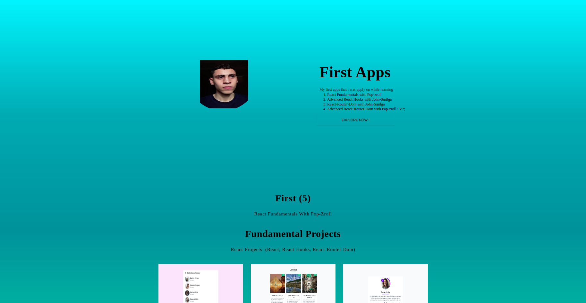
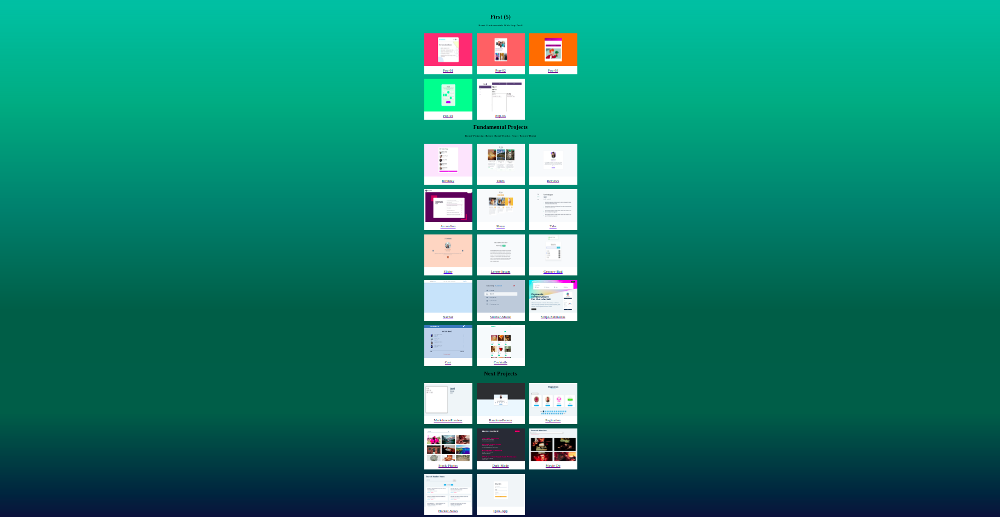

# First-React-Apps;
My first React apps, built on learning and applying on React.

## React Learning Sources
---

1. STEP_01: [12Hr video tutorial](https://www.google.com/search?sca_esv=563740992&q=Learn+react&tbm=vid&source=lnms&sa=X&ved=2ahUKEwj_gdXrqpuBAxXQywIHHVQZBl8Q0pQJegQIDBAB&biw=1848&bih=949#fpstate=ive&vld=cid:a8b6fae0,vid:bMknfKXIFA8) Learning React and building My first 5 app with - pop-zroll - on 12Hr video tutorial on [freeCodeCamp](https://www.youtube.com/@freecodecamp) or on [scrimba.com](https://scrimba.com)

- STEP_02: [30+ Videos Tutorials](https://www.youtube.com/playlist?list=PLC3y8-rFHvwisvxhZ135pogtX7_Oe3Q3A) Learning the advanced React-Hooks with John-Smilga and then bulding 23 React app

- STEP_03: [15 React apps](https://youtu.be/iZhV0bILFb0) 15 apps to apply on the first half of the prev series (step_02 - React-Hooks) specially on
    - useState
    - useEffect
    - useRef
    - useReducer
    - useContext
     
     
    
- STEP_04: [15 Tutorials]() in Learn React-Router-Dom

- STEP_05: Creating more than +5 React app which titled **Buil React advanced apps** with John-Smila on [Udemy](https://www.udemy.com/course/react-tutorial-and-projects-course/) ... thier sources are available on [Github](https://github.com/john-smilga/react-projects) - ***For me the sources was enough to me***;

- STEP_06: [+30 Tutorials](https://www.youtube.com/playlist?list=PLC3y8-rFHvwjmgBr1327BA5bVXoQH-w5s) in learning react-hook-form with John-Smilga on youtube;

- STEP_07: [+9Hr Tutorials](https://scrimba.com/learn/reactrouter6/search-params-intro-coa3e45368b6a832ecd0cd068) on Learning react-router-dom with Pop-zroll on scrimba;

- STEP_08 + STEP(3.5): [30 Tutorials](https://www.youtube.com/playlist?list=PLC3y8-rFHvwheJHvseC3I0HuYI2f46oAK) Cnoketubg Learning Redux, Redux toolkit, and react-redux with John-Smilga on youtube - as we took a look at the step of 3.5 and 4.5 as the syntax was need some time to get famillar with;